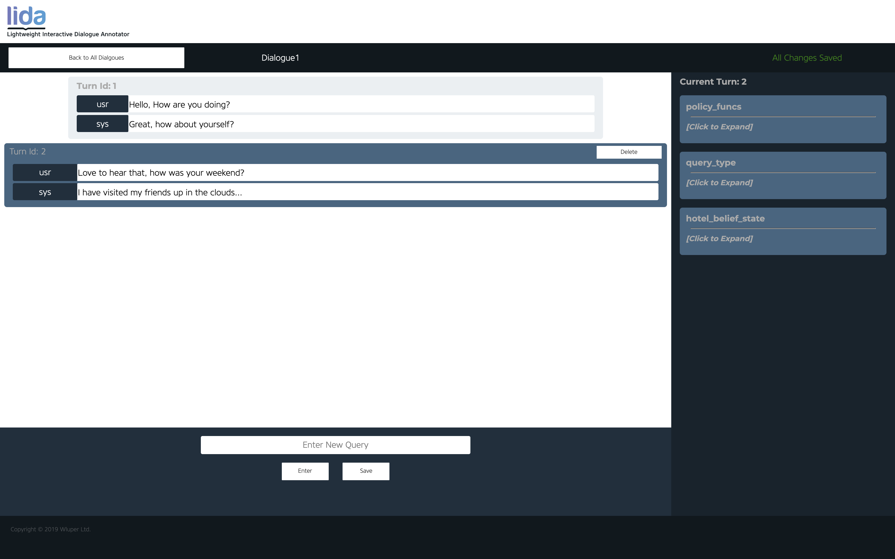
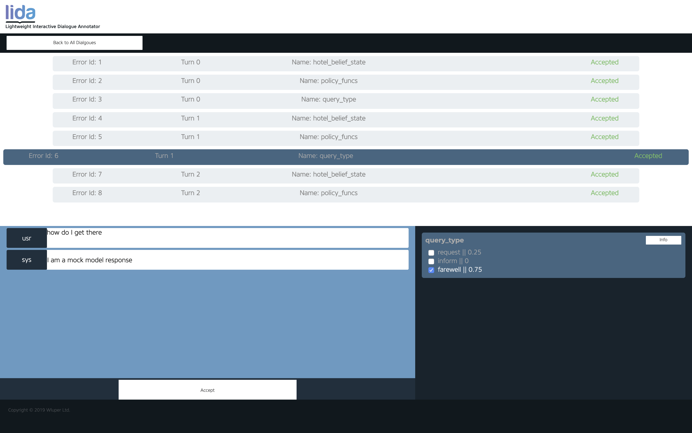
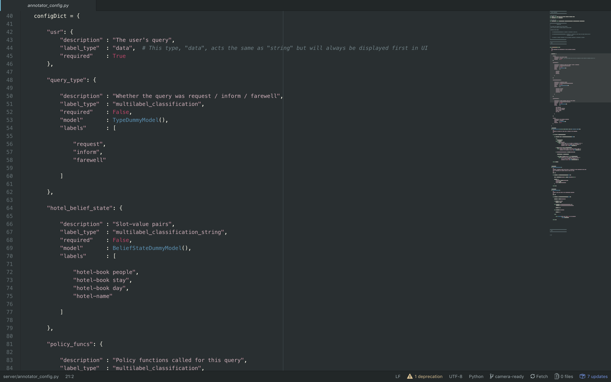
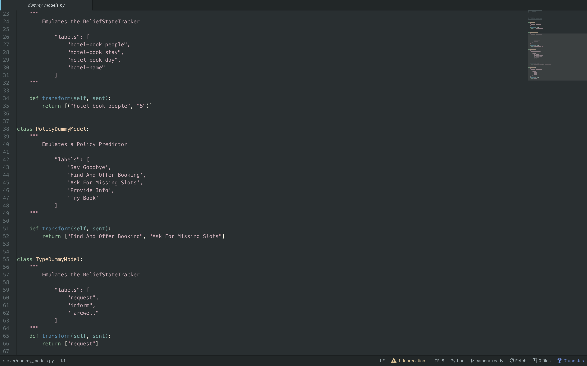

[](https://wluper.com/)     

# LIDA: Lightweight Interactive Dialogue Annotator

**Authors:** Ed Collins, Nikolai Rozanov, Bingbing Zhang,

**Contact:** contact@wluper.com

**Paper:** Link will Follow for the 2019 EMNLP Paper (together with citation)

LIDA is an open source dialogue annotation system which supports the full
pipeline of dialogue annotation from dialogue / turn segmentation from raw
text (as may be output by a transcription service) to labeling of structured
conversation data to inter-annotator disagreement resolution. LIDA supports
integration of arbitrary machine learning (ML) models as annotation recommenders
to speed up annotation, and more generally any system which conforms to the
required API.

LIDA was designed with three use cases in mind:

1. **Experimenting With Dialogue Systems:** users can integrate a dialogue
   system to LIDA's back end and then use LIDA's front end to talk to the
   dialogue system and relabel the things it gets wrong. Users can then download
   these interactions as a JSON file to use a test case in future versions of
   the system.

2. **Creating New Dialogue Datasets:** users can create a blank dialogue in
   LIDA's front end then enter and label queries. They can specify arbitrary
   ML models in the back end, and the entered query will automatically be
   run through all of these.

3. **Labeling Existing Dialogue Datasets:** users can upload either raw .txt or
   .json files by dragging and dropping to LIDA's home screen. If the file is
   a .txt file, the user will be taken to the turn and dialogue segmentation
   screen to split the text file into turns and dialogues. If the file is a
   .json file, it must be in the correct format (described below). Users will
   then be able to label their uploaded data using LIDA's front end. Once
   annotations have been obatined, LIDA's inter-annotator disagreement resolution
   screen can be used to solve conflicts between annotators.

### The annotator screen




### The inter-annotator screen


## Installation

LIDA is a client-server app. The server is written in Python with the Flask
web framework. The front end is written with HTML/CSS/Vue js and communicates
with the back end via a RESTful API. To run LIDA, you will need to first run the
Flask server on your local machine / wherever you want the back end to run.
You will need to have Python 3.6 or above installed on your machine for the
server to run.

### Downloading & Installing Requirements

It is strongly recommended that you clone into a Python virtual environment:

```bash
$ mkdir LIDA/
$ python3 -m venv LIDA/
$ cd LIDA/ && source bin/activate
(LIDA)$ git clone https://github.com/Wluper/lida.git
(LIDA)$ cd lida/
(LIDA)$ pip3 install -r requirements.txt
```

### Running the Main Server

Assuming you have just followed the steps to Download and Install Requirements:

```bash
(LIDA)$ pwd
~/LIDA/lida
(LIDA)$ cd server/
(LIDA)$ python lida_app.py
```

You should see the Flask server running in the Terminal now on port 5000.


### Running the Inter-Annotator Disagreement Resolution Server

Assuming you have just followed the steps to Download and Install Requirements:

```bash
(LIDA)$ pwd
~/LIDA/lida
(LIDA)$ cd server/
(LIDA)$ python interannotator_app.py
```

You should see the Flask server running in the Terminal now on port 5000.

### Running the Front End

Simply double click on `gui/index.html` for the main LIDA app, and on `gui/admin.html`
for the inter-annotator disagreement resolution page.


## Adding Custom Labels

### LIDA Main Tool
All configuration changes that you may wish to make to LIDA can be done in the
file `server/annotator_config.py`. This script contains a configuration dictionary that describes which labels will appear in LIDA's front end.

You can currently add three different types of new labels to LIDA:

1. `multilabel_classification` :: will display as checkboxes which you can
   select one or more of.

2. `multilabel_classification_string` :: will display as checkboxes with values
   next to them and text input fields for a string. This kind of label would
   be used for a slot-value pair in dialogue state tracking, where you have
   the slot name (a classification) and the value (an arbitrary string).

3. `string` :: will display underneath the user's utterance as a string
   response. This is the label field that would be used for a response to the
   user's query.

To add a new label, simply specify a new entry in the `configDict` in
`server/annotator_config.py`.  The key should be the name of the label, and the
value a dictionary which has a field specifying the `label_type`, a boolean
field `required` which defines whether the label is required or not and a field
called `labels` which specify what label values there are for this label (not
applicable to labels of type `string`).

You can optionally add a `description` field and a `model` field which provides
a recommender for the label (see below for details on API requirement). You can
see examples of all label types in `server/annotator_config.py`.

### The Annotator Config file


### LIDA Interannotator Tool

All configuration changes that you would like to add to the Interannotator tool can be done in `server/interannotator_config.py`.

It currently allows you to modify the following:

1. How to treat disagreements etc.

2. How to calculate scores.

## Adding ML Models As Recommenders

All configuration changes that you may wish to make to LIDA can be done in the
file `server/annotator_config.py`. This script contains a configuration
dictionary that describes which labels will appear in LIDA's front end.

To add a recommender, simply add a field called `"model"` to the element of the
config dict that you want to add a recommender for. The value of this field
needs to be a Python object that conforms to the interface defined below.

Any recommender you add to LIDA must conform to the following API: each
recommender is a **Python object** that has a method called `transform`:

`transform(sent: str) -> List[str] or List[Tuple[str, str]] or str`

That is, your recommender only needs to provide a method called `transform` that
takes a single string as input and returns predicted labels. The predictions
need to conform to the `label_type`. What this means is:

* If the element's `label_type` is `multilabel_classification`, then the
  `transform()` method needs to return a list of strings (i.e. a list of
  the labels for the string). For example, for sentiment classification this
  may look like:

  `predictor.transform("I liked the movie") -> ["positive"]`

* If the element's `label_type` is `multilabel_classification_string`, then the
  `transform()` method needs to return a list of tuples, where each tuple
  consists of two strings (i.e. a list of slots and values). For example, for
  hotel belief state tracking this may look like:

  `predictor.transform("I want a hotel for 5 people") -> [("hotel-book people", "5")]`

* If the element's `label_type` is `string`, then the `transform()` method needs
  to also return a string. For example, you could add a dialogue system to LIDA
  using this label type:

  `dialogue_system.transform("I want a hotel") -> "What area of town?"`

You can see more examples of this in `server/dummy_models.py` and see how they
are integrated to LIDA's back end in the current `server/annotator_config.py`
script.

### Dummy Models


## Uploading JSON File Format

If you upload a JSON file representing a dialogue to be labelled, then it must
have the following properties:

* File is a dict with keys as the names of each dialogue and values as lists.

* Each value is a list of dictionaries, where each dictionary contains a number
  of key-value pairs which are used to display the dialogue data for annotation.

* Some key-value pairs are compulsory in order to correctly display the
  dialogue. The key-value pairs which are compulsory are defined in the
  `annotator_config.py` file in the `server` folder.

* By default, the only required key-value pair in each turn is called
  `usr` and should be the user's query as a string.

An example of data in the correct form can be seen in `server/dummy_data.json`.

### JSON Format Example


## Citation
The official citation from the EMNLP 2019 conference in Hong Kong. Please cite this when using.
```
@inproceedings{collins-etal-2019-lida,
    title = "{LIDA}: Lightweight Interactive Dialogue Annotator",
    author = "Collins, Edward  and
      Rozanov, Nikolai  and
      Zhang, Bingbing",
    booktitle = "Proceedings of the 2019 Conference on Empirical Methods in Natural Language Processing and the 9th International Joint Conference on Natural Language Processing (EMNLP-IJCNLP): System Demonstrations",
    month = nov,
    year = "2019",
    address = "Hong Kong, China",
    publisher = "Association for Computational Linguistics",
    url = "https://www.aclweb.org/anthology/D19-3021",
    doi = "10.18653/v1/D19-3021",
    pages = "121--126",
    abstract = "Dialogue systems have the potential to change how people interact with machines but are highly dependent on the quality of the data used to train them.It is therefore important to develop good dialogue annotation tools which can improve the speed and quality of dialogue data annotation. With this in mind, we introduce LIDA, an annotation tool designed specifically for conversation data. As far as we know, LIDA is the first dialogue annotation system that handles the entire dialogue annotation pipeline from raw text, as may be the output of transcription services, to structured conversation data. Furthermore it supports the integration of arbitrary machine learning mod-els as annotation recommenders and also has a dedicated interface to resolve inter-annotator disagreements such as after crowdsourcing an-notations for a dataset. LIDA is fully open source, documented and publicly available.[https://github.com/Wluper/lida] {--}{\textgreater} Screen Cast: https://vimeo.com/329824847",
}
```
